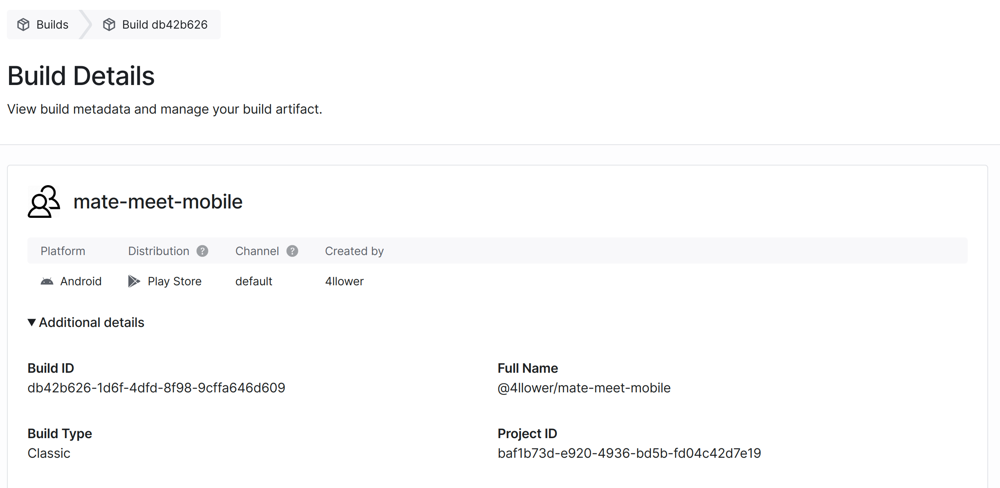

# Mate Meet

*Application from student to students :)*

[ Research & study together ]

The project follows the style described in [pep8](https://www.python.org/dev/peps/pep-0008/)

## Backend

### Deployed application available [http://llower.tech/api/docs/](http://llower.tech/api/docs/)

### [Backend] Preinstall
```
git clone https://github.com/4llower/mate-meet.git
cd make-meet/backend/services/backend # Need to update .env on your environments
```
[.env example](https://github.com/4llower/mate-meet/blob/master/backend/services/backend/.env.example)

### [Backend] Build (folder ./backend)

```bash
$ docker-compose up --build
```

After build service is available on [http://0.0.0.0:8000](http://0.0.0.0:8000)

Documentations available on [http://0.0.0.0:8000/api/docs/](http://0.0.0.0:8000/api/docs/)

### [Backend] Migrations

```bash
$ docker-compose run backend python3 manage.py migrate
```

### [Backend] Linters

```bash
$ docker-compose run backend vulture apps
```

## Frontend

### Android .apk build [here](https://drive.google.com/drive/folders/1M-xjeSdwyMq68MiQPgETLYt2Gk48KOmA?usp=sharing)



*Separated application need to join to folder [./mobile](https://github.com/4llower/mate-meet/tree/master/mobile)*

### [Frontend] Install dependencies
```
yarn
```

### [Frontend] Build
```
yarn start
```
*Need installing Expo GO to run application on device, or using emulator with Expo API*
